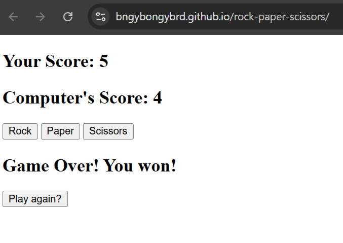

# Rock Paper Scissors

A simple Rock Paper Scissors game built with HTML, CSS, and JavaScript.
[**Play the Demo Here**](https://bngybongybrd.github.io/rock-paper-scissors/)

Click **Rock**, **Paper**, or **Scissors** to make your choice.  
The computer picks randomly. First to **5 points** wins!  
After the game ends, you can click **Play Again** to restart.

## How to Run
1. Download or clone this repo.
2. Open `index.html` in your browser.

## Features
- Player vs Computer
- First to 5 wins
- Play Again button
